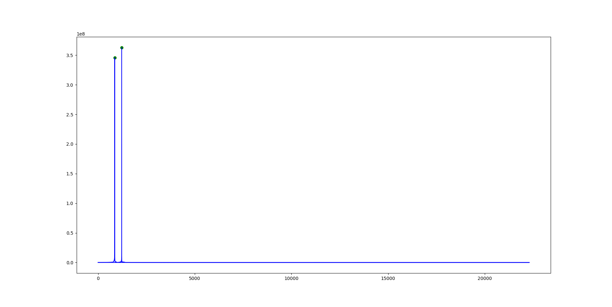

# DFT Project

## Problem
When choosing between the tasks provided, it seemed that I would be able to recognize the telephone key pressed using DTMF tones easily provided I was able to run it through a DFT. The challenging part would be selecting the maxima and translating the frequencies to a keypad value.

## Approach
First, I did some research on how DTMF tones worked. I used this [article](https://en.wikipedia.org/wiki/Dual-tone_multi-frequency_signaling) to help me understand the details gather sample files. 

After that, I settled on using the `scipy` library for the DFT. From there, I messed around with some parameters and was eventually able to read in the wav file and perform a DFT on it. 

Next, I cleaned the results from the DFT and found the maxima. Finding a way to take the most prominent peaks took the most time, but after I found that, I developed a function to find the closest pair of frequencies from the list on Wikipedia. 

This is the result of a DFT on the DTMF tone for 7. Two peaks are obvious, and the green dots show the points identified as maxima by the program. The x values represents the frequencies. The frequencies are used to find the DTMF tone. 

The graph does not show results for "negative" frequencies (this is cleaned early on)

After the program was able to recognize all the files, I set it up to take a file path as the command line argument.

## Results
Given the 16 key press sounds from the Wikipedia page mentioned above, the program is able to correctly identify each sound with its key press. 
